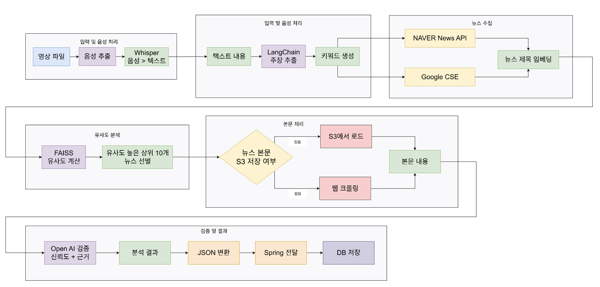
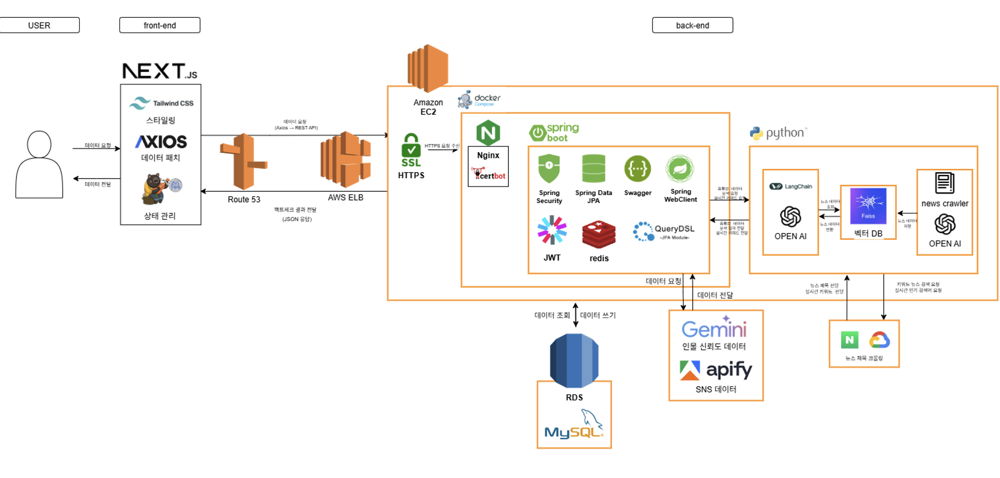

# 🔦 FactSeeker: 주변의 불명확한 정보, 팩트로 다가갑니다.

FactSeeker는 유튜브/뉴스에서 **팩트체크 가능한 주장**을 뽑고, 관련 근거를 찾아 **신뢰도를 평가**한 뒤 **검증 결과를 JSON으로 반환**하는 서버 서비스입니다.

정보가 빠르게 확산될수록 무엇이 사실인지 판단하기 어려워집니다. FactSeeker는 근거 기반 검증 흐름으로 사용자의 판단을 더 단단하게 만들어주는 것을 목표로 합니다.

---

## 주요 기능

- `POST /fact-check`: 유튜브 URL → Whisper 자막 → 주장 추출/중복 제거 → 뉴스(제목) 검색/FAISS 매칭 → 기사 본문 크롤링 → LLM 팩트체크
- `POST /article-fact-check`: 기사 URL → 기사 본문 → 주장 추출/중복 제거 → 위와 동일한 근거 검색/팩트체크
- 제목 FAISS 인덱스는 **S3 프리로드** 후, S3 변경을 감지해 **자동 재로딩**(옵션)
- 기사 본문(개별 URL)은 **로컬/ S3 캐시(FAISS)** 로 재사용

---

## 🧠 동작 흐름

입력 → 자막/본문 확보 → 주장 추출/정제 → 뉴스 검색 + FAISS 매칭으로 근거 후보 수집 → 기사 본문 확보 후 LLM 검증 → JSON 결과 반환

---

## 흐름도

## 아키텍쳐

